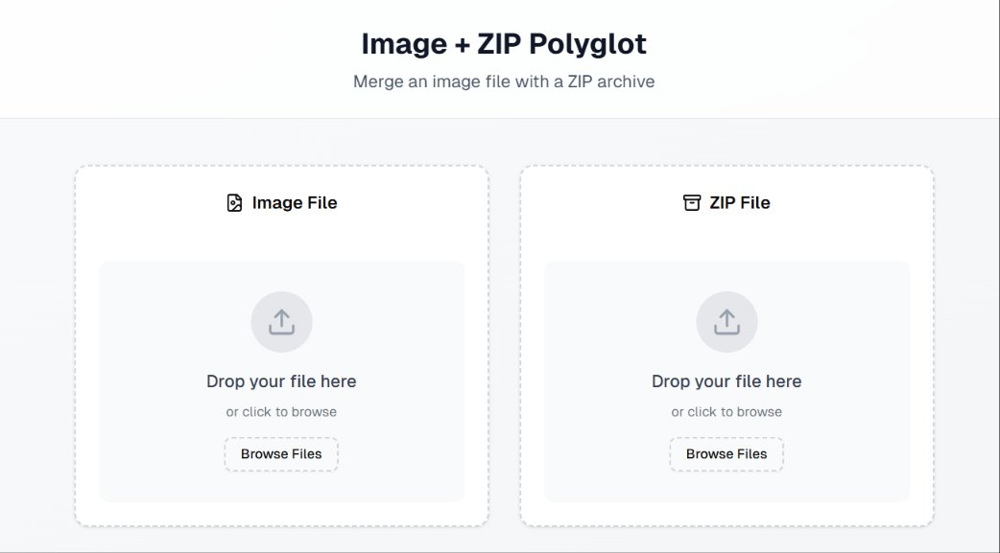
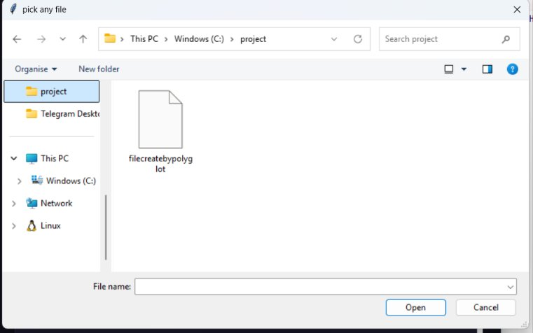
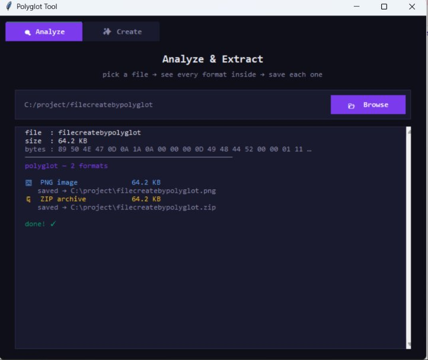
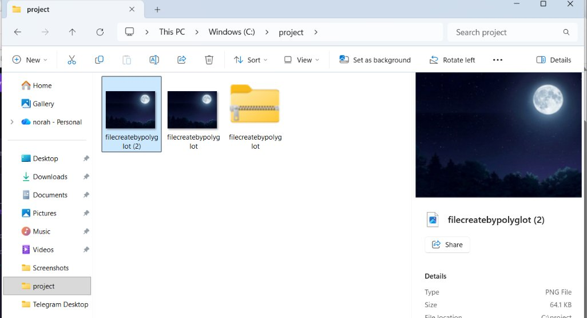

#  POLYGLOT TOOL

>  **polyglot files** — single files that are valid in multiple formats simultaneously.

---

## What is a Polyglot File?

A polyglot file is a file that conforms to more than one file format at the same time. For example, a single file can be opened as a PNG image, played as an MP4 video, read as a PDF document, and extracted as a ZIP archive — all without modification. This tool lets you both **create** and **analyze** such files with a clean graphical interface. And this is the website https://www.glotfiles.dev/ for make glotfile. 

---

## Features

###  Analyze & Extract 
- Load any file and automatically detect all hidden formats inside it
- Detects: PNG, JPEG, GIF, WebP, ICO, PDF, MP4, AVI, MKV, ZIP, RAR, 7z, MP3, WAV
- Displays offset position, file size, and format type for each detected layer
- Extracts each format to a folder of your choice
- Color-coded log output for easy reading

###  Create 
- Combine multiple files into a single polyglot file
- Choose from preset combinations:
  - `PDF + Video + Image + ZIP`
  - `PDF + Video + ZIP`
  - `ZIP + Video + Image`
  - `Image + Video + PDF`
  - `PDF + Image`
  - `Image + ZIP`
- Automatically corrects MP4 chunk offsets (`stco`/`co64` boxes) so video playback works correctly after embedding
- Saves the output as a `.png` file that secretly contains all other formats

---

## Requirements

- Python 3.7+
- Tkinter (usually included with Python — if not, install `python3-tk`)

No third-party libraries are required. The tool uses only Python's standard library.Recommend use pycharm. 

---

## Installation

```bash
git clone https://github.com/norahal2003/Glotfile-analyzer.git
cd polyglot-tool
python main.py
```

---

## Usage

### Analyzing a File

1. Open the app and go to the **ANALYZE** tab
2. Click **BROWSE** and select any file
3. The tool will scan the file and display all detected formats in the log
4. You will be prompted to choose a folder where the extracted files will be saved

### Creating a Polyglot File

1. Go to the **CREATE** tab
2. Select a combination from the dropdown menu
3. Browse and load each required file into its slot
4. Click **✳ CREATE POLYGLOT**
5. Choose where to save the output file

The output file is saved as a `.png`. To access the other embedded formats, rename the file with the appropriate extension (e.g. `.pdf`, `.mp4`, `.zip`).

---

## Supported Format Combinations

| Combination | How to Access Each Format |
|---|---|
| PDF + Image | Open directly → image · Rename `.pdf` → PDF |
| Image + ZIP | Open directly → image · Rename `.zip` → ZIP |
| Image + Video + PDF | Open directly → image · Rename `.mp4` → video · Rename `.pdf` → PDF |
| ZIP + Video + Image | Open directly → image · Rename `.mp4` → video · Rename `.zip` → ZIP |
| PDF + Video + ZIP | Open directly → image · Rename `.mp4` → video · Rename `.pdf` → PDF · Rename `.zip` → ZIP |
| PDF + Video + Image + ZIP | Open directly → image · Rename `.mp4` → video · Rename `.pdf` → PDF · Rename `.zip` → ZIP |

---

## Detected Formats

| Category | Formats |
|---|---|
| Images | PNG, JPEG, GIF, WebP, ICO |
| Documents | PDF |
| Video | MP4, AVI, MKV, MOV |
| Audio | MP3, WAV |
| Archives | ZIP, RAR, 7z |

---

## Project Structure

```
polyglot-tool/
├── our main.py   # Main application (single file)
├── README.md
└── screenshots/
    ├── analyze_empty.png
    ├── file_picker.png
    ├── analyze_result.png
    └── extracted_files.png
```

---

## Implementation and Testing — Analyze interface 

This section demonstrates the Analyze tab in action using a real polyglot file.

---

### Step 1 — Tool Interface Analyze 

The Analyze tab on launch, ready to accept any file for scanning.



---

### Step 2 — Select the Polyglot File

A file named `filecreatebypolyglot` is selected from the project folder using the Browse dialog.



---

### Step 3 — Analysis Result

The tool scans the file and detects **2 formats** embedded inside it: a PNG image (64.2 KB) and a ZIP archive (64.2 KB). Both are extracted and saved to the project folder automatically.



---

### Step 4 — Extracted Files in Explorer

After extraction, the project folder contains the original polyglot file alongside the two extracted files — the PNG image and the ZIP archive — confirming successful detection and extraction.



---

## Notes

- The tool trims PNG and JPEG carriers to their proper end markers (`IEND` / `FFD9`) before appending other formats, ensuring clean embedding
- MP4 files embedded after other data have their `stco` and `co64` chunk offset tables automatically corrected so video players can read them properly
- Format detection ignores signatures found inside PDF or MP4 `mdat` sections to avoid false positives

---

## License

This project is open source.

---

## Authors

Built by:

- **Noura Alsubaie**
- **Lina Alghamdi**

Contributions and issues are welcome.
